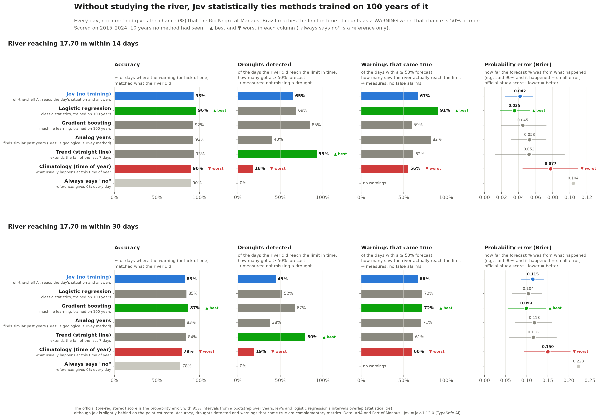
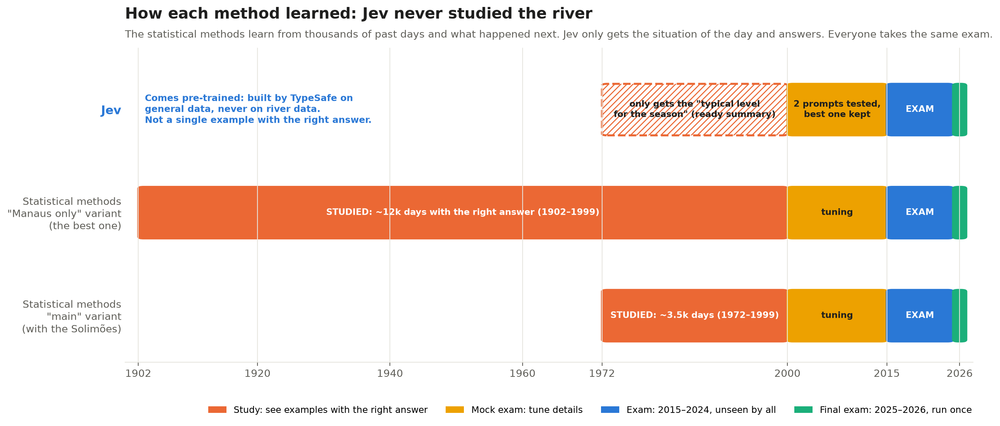

# Can an untrained AI forecast droughts on the Rio Negro?

When the Rio Negro at Manaus drops below 17.70 m, shipping lines start charging a low-water surcharge (US$ 4,592 per container in 2026) and cargo for the Manaus Industrial Pole gets more expensive and slower. This project asks a narrow question: **can [Jev](https://typesafe.ai/blog/introducing-system-one-models-and-jev), a decision model that was never trained on river data, tell days ahead whether the river will cross that line?**

Every day of the dry season, Jev and five traditional forecasting methods answer the same question: *"what is the chance that the level at Manaus falls to the limit within the next 14 (or 30) days?"* All of them are scored on 2015–2024, ten years none of them had seen. The analysis plan was committed before any test forecast existed ([PREREGISTRATION.md](PREREGISTRATION.md)).



## Results

| | 17.70 m within 14 days | 17.70 m within 30 days |
| --- | --- | --- |
| Jev vs. climatology | **Jev better** (Brier 0.042 vs 0.078, 95% CI excludes zero) | Jev ahead (0.115 vs 0.150), CI touches zero |
| Jev vs. best trained model (logistic regression) | Tie within uncertainty (0.043 vs 0.035) | Tie within uncertainty (0.122 vs 0.104) |

- With no training at all, Jev clearly beats the "what usually happens this time of year" baseline and lands in the same statistical range as models trained on up to 100 years of the river. On the point estimate it is a bit behind the best of them.
- Its answers are stable: renaming or reordering the answer options flips at most ~2% of decisions.
- No sign of memorization: adding the date and year to the input did not improve its forecasts for the famous 2023 and 2024 droughts.
- In the final holdout (2025–2026, run once) Jev raised one false alarm in October 2025. It reached 67%, and the river stopped at 18.90 m.
- The whole study used 13,044 Jev calls and cost US$ 0.75.

Full write-up (in Portuguese): [docs/resultados_braco_a.md](docs/resultados_braco_a.md). Figures and tables: [notebooks/02_resultados_braco_a.ipynb](notebooks/02_resultados_braco_a.ipynb).



## How it works

**Data.** Daily river level at Manaus since 1902 and upstream at Manacapuru (Solimões) since 1972, both from the public ANA web service. For 2000 onwards the official Port of Manaus gauge is also used: it matches ANA's gauge (median difference 0 cm) and is the reference shipping lines use. ANA's telemetry sensor drifts up to 40 cm from it, so the sensor is only a last resort. Details and the data dictionary: [docs/dados.md](docs/dados.md).

**Task.** One forecast per day, from July 1 to the yearly minimum, only while the river is still above the limit. Two limits (17.70 m and 15.0 m) times two horizons (14 and 30 days). Each forecast only uses information available on that day.

**Methods.**

- **Climatology:** how often the river crossed from similar levels at the same time of year.
- **Trend:** extends the last 7 days of fall in a straight line.
- **Analog years:** finds past seasons with a similar curve. This is the approach Brazil's geological survey (SGB) uses.
- **Logistic regression and gradient boosting:** trained on 1902–1999 (or 1972–1999 when Manacapuru is used), tuned on 2000–2014.
- **Jev:** gets the day's situation as text, with no year and no date, and answers with a probability. The arithmetic (distance to the limit, days to reach it at the current rate) is done in code, following Jev's own docs.

**Evaluation.** Brier score as the main metric, with 95% confidence intervals from a bootstrap over whole years, since days within a year are correlated. Secondary checks: calibration, warning lead time, false alarms, sensitivity to how the question is worded, and a memory test.

## Running it

Requires Python 3.12 and [uv](https://docs.astral.sh/uv/).

```bash
uv sync

# 1. Data: ANA web service + Port of Manaus (no credentials needed, ~30 min on the first run)
uv run python -m supplyrisk.download
uv run python -m supplyrisk.serie        # one daily series per station
uv run python -m supplyrisk.amostras     # forecast days, features and labels

# 2. Experiment
uv run python -m supplyrisk.experimento baselines teste
uv run python -m supplyrisk.experimento jev teste
uv run python -m supplyrisk.analise teste
```

The processed data and every Jev request/response are versioned in `data/`, so the analysis and notebooks run without downloading anything or calling the API. Only new Jev calls need a key: put `JEV_API_KEY=...` in a `.env` file at the project root.

## Layout

```text
src/supplyrisk/
  ana.py, porto.py, download.py   data collection
  serie.py, amostras.py           daily series, forecast days and features
  baselines.py, jev.py            the methods
  experimento.py, analise.py      runs and pre-registered analyses
  avaliacao.py                    metrics, bootstrap, lead time
notebooks/
  00_dados_brutos.ipynb           from raw API responses to tables
  01_exploracao_dados.ipynb       data checks and base rates
  02_resultados_braco_a.ipynb     results and figures
data/
  raw/, processed/                downloaded and standardized data
  jev/                            every Jev call (input and output)
  resultados/                     predictions, metrics, tables
docs/                             data documentation, results, figures
```

## Limitations

- Ten test years. The 15 m limit was only crossed in two of them (2023 and 2024), so those results are indicative.
- This is a numeric problem, which is not where Jev is strongest: its docs say it struggles with numeric precision. A follow-up will add text (the weekly SGB hydrological bulletins) to the input.
- There is no way to prove Jev never saw recent river data during its training. The memory test only shows that giving it the year did not help.

## License

Code under the [MIT License](LICENSE). River data comes from ANA and the Port of Manaus and follows their terms of use.
